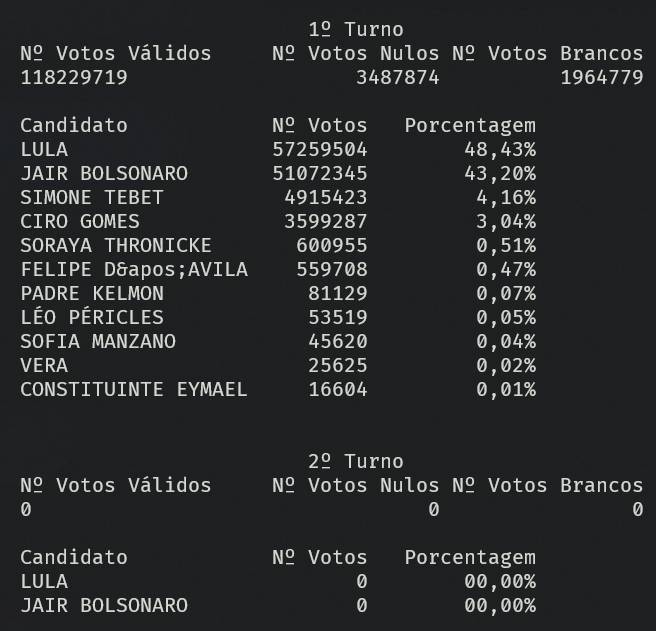

 align-items: space-between; justify-content: space-evenly;">
  <h1>Eleicoes 2022<h1>
  

Durante as eleições vi algumas postagens sobre o consumo da API para captura do resultado das eleições em tempo real.
Inspirado por isso decidi usar esse momento para aprofundar meus estudos em Golang.

Inspirado nesse entusiasmo criei uma aplicação simples para consumir e aprensentar os resultados dos dois turnos da eleição, já estando consumindo a API para o segundo turno também.

Durante o desenvolvimento encontrei agumas diferenças no uso do <code>go</code> para consumo de APIs e tentarei explica-las brevemente aqui.

A primeira diferença que encontrei foi com a forma como funciona os retornos dos métodos de requisação do go. Ele possui um pacote nativo de consumo de requisação HTTP que é relativamente fácil de usar, sendo necessário realizar o import do pacote <code>"net/http"</code> <a href="https://pkg.go.dev/net/http">[documentação]</a>.
Contudo esses métodos me retornam os byte da requisação. Então se faz necessário converter os byte nos dados que iremos consumir efetivamente. Acostumado com aplicações em NodeJS e PHP, onde o consumo de dados JSON é bem simples e intuitivos.

Encontrei o maior diferencial onde a liguagem não realiza a conversão nativamente, ela me permite e induz a realizar a conversão dos byte no dado que eu preciso, e para isso foi preciso definir as <code>struct</code> com o padrão de retorno, e após definir eu uso o pacote nativo do go <code>encoding/json</code> <a href="https://pkg.go.dev/encoding/json">[documentação]</a>. Onde dentro dela eu tenho o <code>json.Unmarshal</code>, ele que é o responsável pela conversão na estrutura já definida.

Com isso foi possível definir o resultado abaixo:

  

